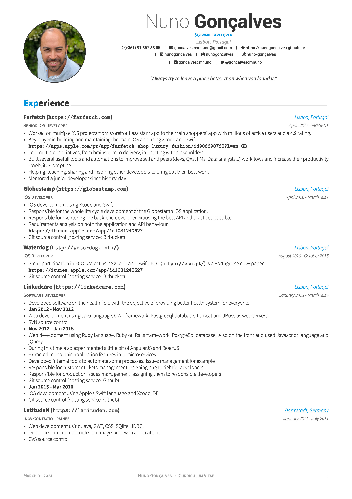
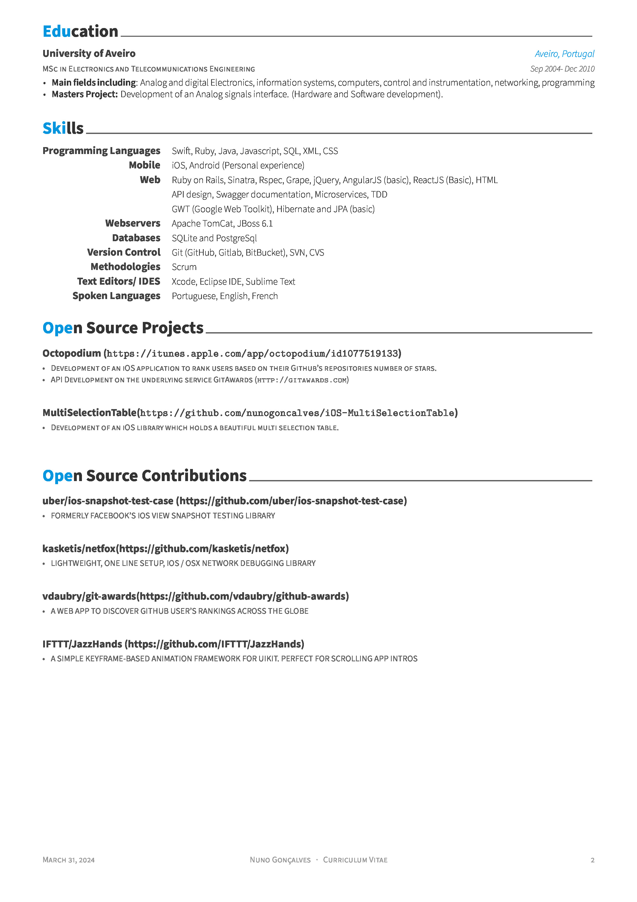

# resume
My resumé - Powered by LaTeX

This repository contains a project to build my resumé. It uses the [Awesome CV](https://github.com/posquit0/Awesome-CV) template by [posquit0](https://github.com/posquit0).

Steps to build the Resume.

1. Install LaTeX. https://tug.org/mactex/
2. Install a TeX editor. http://www.texstudio.org/
3. Clone this repository
4. On a Mac open Font Book app and import the /fonts/FontAwesome.ttf and /fonts/Roboto fonts
5. Open Resume.tex on TeXStudio
6. Run and tap View (the white page with a magnifiyng glass).
7. If you have ImageMagick installed, run `convert -density 300 Resume.pdf Resume.jpg` to render jpg images from the pdf version and you can add them to this README.

Tips:
If you need to add specific icons, check this: http://fontawesome.io/cheatsheet/ and change fontawesome.sty file accordingly.

    
|      |      |
|------|------|
|  |  |

